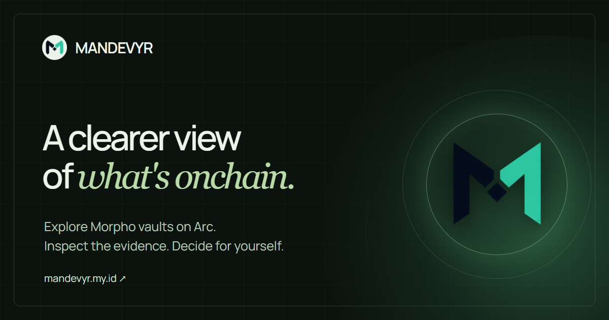
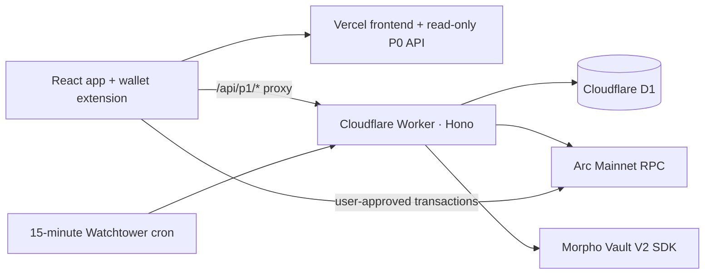

# MANDEVYR



**A decision workspace for Morpho vaults on Arc Mainnet.** MANDEVYR connects vault research, personal limits, transaction review, and onchain receipts so people can inspect an action before confirming it in their own wallet.

[Live app](https://www.mandevyr.my.id/app) · [Product docs](https://www.mandevyr.my.id/docs) · [Actions](https://www.mandevyr.my.id/app/actions) · [Token utility](https://www.mandevyr.my.id/app/utility)

Built by [Ardian3D](https://github.com/Ardian3D). This repository contains the product's frontend, API, Arc integrations, tests, and deployment configuration. The [product plan](PRD.md) and [release record](docs/phase-3-4.md) document the design and verification work.

## The product

Vault dashboards can make an opportunity look simple while the contract, asset, approval, liquidity, and wallet transaction remain hard to inspect. MANDEVYR makes those details part of one workflow:

1. **Explore** three curated Morpho Vault V2 routes on Arc Mainnet: Galaxy USDC, Gauntlet USDC Prime, and Gauntlet EURC Prime. The registry checks contract code, asset identity, and total assets at a recorded Arc block.
2. **Set a mandate** with allowed vaults and action limits. Wallet sign-in uses a message; submitting an onchain Action requires a separate wallet confirmation.
3. **Run a preflight** to save the evidence and reasons behind a proposed move. A preflight is research, not permission to transact.
4. **Review an Action** with contract, calldata, approval, simulation, share-price tolerance, gas estimate, and mandate checks before the wallet prompt.
5. **Keep the trail** in History and Watchtower. Watchtower checks source availability every 15 minutes; it does not monitor yield or guarantee withdrawal liquidity.

The app does not show an APY without a verified source, calculation method, fee treatment, and time window. Vault identity checks also do not establish strategy safety or instant exit capacity.

## What is live and what is proven

Status checked on **October 8, 2026** against the production health endpoint and the [release record](docs/phase-3-4.md).

| Area | Product status | Evidence and boundary |
| --- | --- | --- |
| Vault research | Live on Arc Mainnet | Three curated routes with onchain contract and asset checks; no unverified APY. |
| Mandates, preflights, History, Watchtower | Live | Wallet-scoped records in Cloudflare D1; Watchtower reports source availability changes. |
| Morpho Actions | Production writes enabled | Galaxy USDC has a small funded deposit and withdrawal. Gauntlet USDC Prime and EURC Prime still need funded execution tests and an independent integration review. |
| MDVYR holder utility | Live | A signed-in wallet gets one new saved-report deep dive per UTC day; holding at least 1 MDVYR raises that to five. Core research remains available without the token. |
| Agent policy reviews | Live | HTTPS origin and endpoint allowlists, request and daily USDC caps, and manual review; no automatic external payment. |
| x402 paid report | Restricted wallet pilot | The 0.01 USDC checkout is limited to a configured test wallet. Funded settlement and recovery have not yet been verified, so public paid access remains disabled. |

### Funded Arc Mainnet example

On October 5, 2026 UTC, a wallet used the public Actions flow for Galaxy USDC. Each step required its own wallet confirmation. Direct Arc RPC receipts reported success (`0x1`).

| Step | Observed result | Receipt |
| --- | --- | --- |
| USDC approval | Exact 0.05 USDC allowance | [Arc transaction](https://explorer.arc.io/tx/0x1e399bf10c883ac05c2a32d5345d9fba1d167e64666067afee1f4be286cb0679) |
| Deposit | 0.05 USDC supplied; vault shares minted | [Arc transaction](https://explorer.arc.io/tx/0x2240672c72b9c9e6a41b2d548d57ae478796db517bb8ff5ac43f20489cd60e8c) |
| Vault-share approval | Exact protected allowance for the withdrawal | [Arc transaction](https://explorer.arc.io/tx/0xb0a96ce0394bf9b92051aff3e6bb32930bf511bad8c4d93bb2bad3afd70c6138) |
| Withdrawal | 0.04 USDC returned to the wallet | [Arc transaction](https://explorer.arc.io/tx/0x7149b435ae660aa948ff82a2f72d3247813fae5e65dad050ef1ac778bfb37689) |

The [funded test record](docs/p2-funded-galaxy-2026-10-05.md) includes the exact share amounts and the expired quote that required a fresh review. This verifies one path at that time; it does not prove future liquidity or other vault routes.

## Architecture



- **Frontend:** React, TypeScript, Vite, React Router, Tailwind CSS, GSAP, and Three.js.
- **Backend:** Hono on Cloudflare Workers, D1 for signed-in records and audit trails, and Vercel routing for the public site.
- **Chain integration:** viem, the Morpho SDK, Arc Mainnet (chain ID `5042`), and wallet confirmation for each transaction.
- **Quality gates:** Vitest, Oxlint, TypeScript checks, production build, and [GitHub Actions CI](.github/workflows/ci.yml).

The read-only registry uses a reviewed address list in [`src/p0/registry.ts`](src/p0/registry.ts). It records the Arc block and fetch time, and marks failed or stale checks explicitly. Signed-in data and Action audit records live in D1. The app does not request or store a wallet private key.

### Engineering decisions

- **Keep evidence tied to a block.** Contract code, base-asset identity, and vault totals are read against a recorded Arc block; stale or failed reads remain visible instead of silently looking current.
- **Separate research from execution.** Preflight reports record what was known at review time. Actions recheck the transaction route and mandate before requesting a wallet transaction.
- **Preserve wallet control.** SIWE protects wallet-scoped records, while approvals and vault transactions need separate wallet prompts. The server never holds a signing key.
- **Account for Arc's USDC model.** Native USDC pays gas and is displayed as one balance; vault asset amounts and shares retain their own units. The app does not double-count native and contract representations of USDC.
- **Make the interface usable beyond animation.** The 3D hero has pointer and keyboard controls, reduced-motion handling, and a static fallback; Actions and research pages adapt to mobile layouts.

## MDVYR utility

`MDVYR` is an ERC-20 token on Arc Mainnet at [`0xeD2CBF69b36A0E26De6d121be086f31EDAf3b424`](https://www.mandevyr.my.id/app/utility). The server verifies token identity and the signed-in wallet's balance onchain before granting the five-report daily allowance. Existing reports can be reopened without using another daily slot. The product benefit does not depend on token price.

Final token allocation, treasury, and vesting disclosures have not yet been published. Market fee terms and an independent security review still need verification. No price or return claim is made here.

## Run locally

Requires Node.js **22.12+** and npm. Local D1 data is separate from production.

```bash
npm ci
npx wrangler d1 migrations apply mandevyr-p1 --local
npm run dev
```

Open the Vite URL shown in the terminal, usually `http://localhost:5173`. The Cloudflare Vite plugin runs the local Hono API under `/api/*`; opening the built HTML file directly will not provide Arc or D1 data.

```bash
npm run lint
npm run typecheck
npm run test
npm run build
```

For focused read-only integration checks, see [`scripts/verify-p2-mainnet.mjs`](scripts/verify-p2-mainnet.mjs) and its [latest saved result](docs/p2-mainnet-verification.json). The [P1 smoke script](scripts/smoke-p1.mjs) exercises session, mandate, report, and wallet-scope behavior locally. Neither script signs or broadcasts a funded transaction.

## Deployment and next verification

The canonical site is [mandevyr.my.id](https://www.mandevyr.my.id/). Vercel serves the frontend and read-only P0 API; `/api/p1/*` is proxied to the Cloudflare Worker with D1 and a 15-minute Watchtower cron. Configuration is in [`vercel.json`](vercel.json) and [`wrangler.jsonc`](wrangler.jsonc).

The remaining production evidence is specific: funded tests for both Gauntlet vaults, an independently reviewed Actions integration, a funded x402 settlement and recovery test, and final token and treasury disclosures. The [release record](docs/phase-3-4.md) tracks those gates.

## License and assets

Project-authored source code and documentation are dual licensed under **[MIT](LICENSE-MIT) OR [Apache-2.0](LICENSE-APACHE)**, at your option; see [`LICENSE`](LICENSE). This choice does not relicense MANDEVYR brand marks, third-party Arc/Morpho/curator logos, fonts, user-provided screenshots, or generated audio and video. See [asset and attribution details](ASSET-LICENSES.md) and the license files next to individual assets.

Arc, Morpho, Argus, and named curators are independent services and brands; their appearance here does not imply endorsement.
